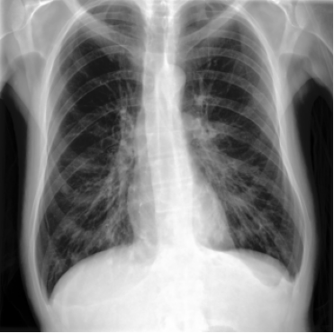

# Multimodal RAG for Chest X-Ray Report Generation

Generate the **Impression** section of a chest X-ray report by retrieving clinically similar prior reports and synthesizing them with a large language model — a multimodal **Retrieval-Augmented Generation (RAG)** pipeline.

General-purpose LLMs can write fluent radiology text but may **hallucinate findings**, which is unsafe in clinical settings. This system avoids that by grounding every generated impression in **real retrieved reports** from visually similar X-rays.

---

## How it works

```
Chest X-ray  ──►  ALBEF image encoder  ──►  image embedding
                                                   │
                                    cosine search over vector DB
                                                   │
                              top-k similar impressions
                                                   │
                          top-k evidence  ──►  LLM (constrained prompt)
                                                   │
                                         generated Impression
```

1. **Image encoding** — A domain-adapted **ALBEF** model encodes the chest X-ray into a shared image–text space.
2. **Vector database** — All training impressions are embedded once and stored in a **Chroma** database.
3. **Retrieval** — The query image retrieves the most similar impressions using cosine similarity.
4. **Grounded generation** — A local LLM (**Qwen2.5-32B via Ollama**) generates the final impression using only retrieved evidence.

All inference runs **locally** — no clinical data is sent externally.

---

## Results (Test Set)

| Method              | CheXbert micro-F1 | CheXbert macro-F1 
| ------------------- | ----------------- | ----------------- 
| **RAG (generated)** | **0.363**         | **0.249**        

(5-finding micro-F1: 0.438)

---

## Key observations

* Performance is **limited by retrieval quality** — the model cannot generate findings that were not retrieved.
* The LLM improves **fluency and coherence** of reports.
* Rare findings are harder to capture due to dataset imbalance.

---

## Why clinical metrics?

Standard NLP metrics (BLEU, ROUGE) measure text similarity but not clinical correctness.

This project uses **CheXbert F1**, which compares reports based on **14 clinical findings**, ensuring evaluation reflects actual diagnostic agreement.

---

<!-- ## What is mine vs prior work

Built on **CXR-ReDonE (Rajpurkar Lab)**:

* **From prior work:**

  * ALBEF retrieval model
  * MIMIC-CXR dataset
  * CheXbert labeler

* **My contribution:**

  * LLM-based **generation layer**
  * Chroma vector database pipeline
  * Evidence-constrained prompting
  * Clinical vs semantic evaluation of RAG

--- -->

## Stack

`PyTorch` · `ALBEF` · `Chroma` · `Ollama` · `Qwen2.5-32B` · `CheXbert` · `BERTScore` · `HDF5`

---

## Running the project

### 1. Environment

```bash
pip install -r requirements.txt
```

### 2. Download data

* Dataset: https://drive.google.com/file/d/1fyVv1PSI3GhbfDSNIXDwoWz9kq7NQbaJ/view?usp=sharing

### 3. Download model checkpoint

* ALBEF checkpoint: https://www.dropbox.com/s/b4tkf2z4v6wa4zj/checkpoint_59.pth?dl=0

Place in:

```
chkpts/checkpoint_59.pth
```

### 4. Build vector database

```bash
python build_db.py
```

### 5. Generate reports

```bash
python generate.py
```

### 6. Evaluate

```bash
python evaluate.py
```

---

## Project structure

| File               | Description                      |
| ------------------ | -------------------------------- |
| `encoders.py`      | ALBEF model loading and encoding |
| `image_dataset.py` | HDF5 image loading               |
| `build_db.py`      | Build Chroma vector DB           |
| `retrieve.py`      | Image → similar impressions      |
| `generate.py`      | Evidence → LLM → report          |
| `evaluate.py`      | CheXbert + BERTScore             |

---

## Example

### Input chest X-ray



### Generated Impression

```
Bilateral opacities concerning for multifocal pneumonia.

```

---

## Notes

* Fully **local pipeline** (no API usage)
* Designed for **research use only**
* Requires access to MIMIC-CXR dataset

---
